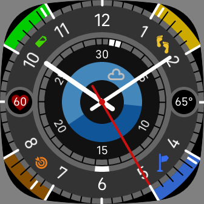

# fitbit-gauges
## Analog clock with sensor info for Fitbit Versa 3 and Sense
### https://gallery.fitbit.com/details/14697995-0985-4c27-bbed-a83c716dbb91

This is an analog clock with selected sensor information, plus date and weather. Included sensors are: 
+ Battery
+ Heart Rate
+ Steps
+ Distance
+ Active Zone Minutes

Battery, Steps, Distance and Active Zone sensors have a status display on the outside corners of the clock face, with indicators set for 20%, 40%, 60% and 80%. Month and date are displayed on the inner rings of the clock face, with the month aligned to the hour markers, and separate markers for the day. There is an extra 'half' marker between 30 and 1 for months with 31 days. Heart rate has a separate ring at 9 o'clock.

Current weather conditions and sunrise/sunset times are depicted in the center of the dial, and current temperature has a separate ring at 3 o'clock. Make sure to select a temperature unit (C/F) in the settings to enable weather.

This clock has only been tested on Fitbit Versa 3, so please feel free to submit a pull request with any improvements or bug fixes.
